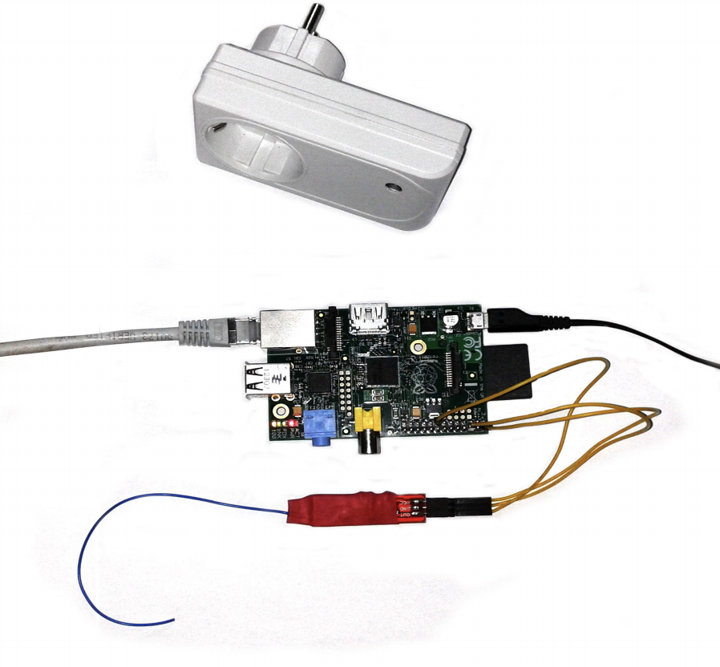

# About

rcswitch-pi is for controlling rc remote controlled power sockets 
with the *raspberry pi*. 

It work with a 315/433MHz transmitter (e.g. https://www.robofun.ro/telecomanda-prize-434MHz-daisypi-raspberry-pi?search=radio) and an radio controlled outlet having a SC5262 / SC5272, HX2262 / HX2272, PT2262 / PT2272, EV1527, RT1527, FP1527 or HS1527 chipset. It also supports Intertechno outlets.



Kudos to the projects 
[rc-switch](http://code.google.com/p/rc-switch),
[wiringpi](https://projects.drogon.net/raspberry-pi/wiringpi)
[r10r/rcswitch-pi](https://github.com/r10r/rcswitch-pi) for adapting the rc-switch code to use the wiringpi library instead of the library provided by the arduino.

I just adapted the send.cpp and usage message to allow the use with all types of switches (type A, B and Intertechno C).

## Install

First you have to install the [wiringpi](https://projects.drogon.net/raspberry-pi/wiringpi/download-and-install/) library.
For this, just execute the following commands:
```
git clone git://git.drogon.net/wiringPi
(if the above fails, use git clone https://github.com/wiringpi/wiringpi)
cd wiringPi
git pull origin
./build
```
Then you may install this library.
```
git clone https://github.com/mar1u50/rcswitch-pi
cd rcswitch-pi
```
Open send.cpp and update the variable PIN.
I'm using BCM GPIO pin 22 and in wiring pi this means PIN=3. For more information about the mapping between GPIO pins and wiringPi pins please see [wiringPi pins] (http://wiringpi.com/pins/).

Compile the `send` program by running `make`.

## Usage
Run `sudo ./send` to print the usage.

## Scheduling
We can program raspberry pi to switch on / off the power socket at certain hours.
To do that, edit `/etc/crontab`.
Inside the file you can add
```
01 16	* * *	root	/home/pi/wiringpi/rcswitch-pi/send b 1 1 1 2>&1
02 16	* * *	root	/home/pi/wiringpi/rcswitch-pi/send b 1 2 1 2>&1
03 16	* * *	root	/home/pi/wiringpi/rcswitch-pi/send b 1 1 1 2>&1
04 16	* * *	root	/home/pi/wiringpi/rcswitch-pi/send b 1 2 1 2>&1

01 0	* * *	root	/home/pi/wiringpi/rcswitch-pi/send b 1 1 0 2>&1
02 0	* * *	root	/home/pi/wiringpi/rcswitch-pi/send b 1 2 0 2>&1
03 0	* * *	root	/home/pi/wiringpi/rcswitch-pi/send b 1 1 0 2>&1
04 0	* * *	root	/home/pi/wiringpi/rcswitch-pi/send b 1 2 0 2>&1
```
Note: I switch the lights on or off twice just to be sure the message has been received by the swich.
